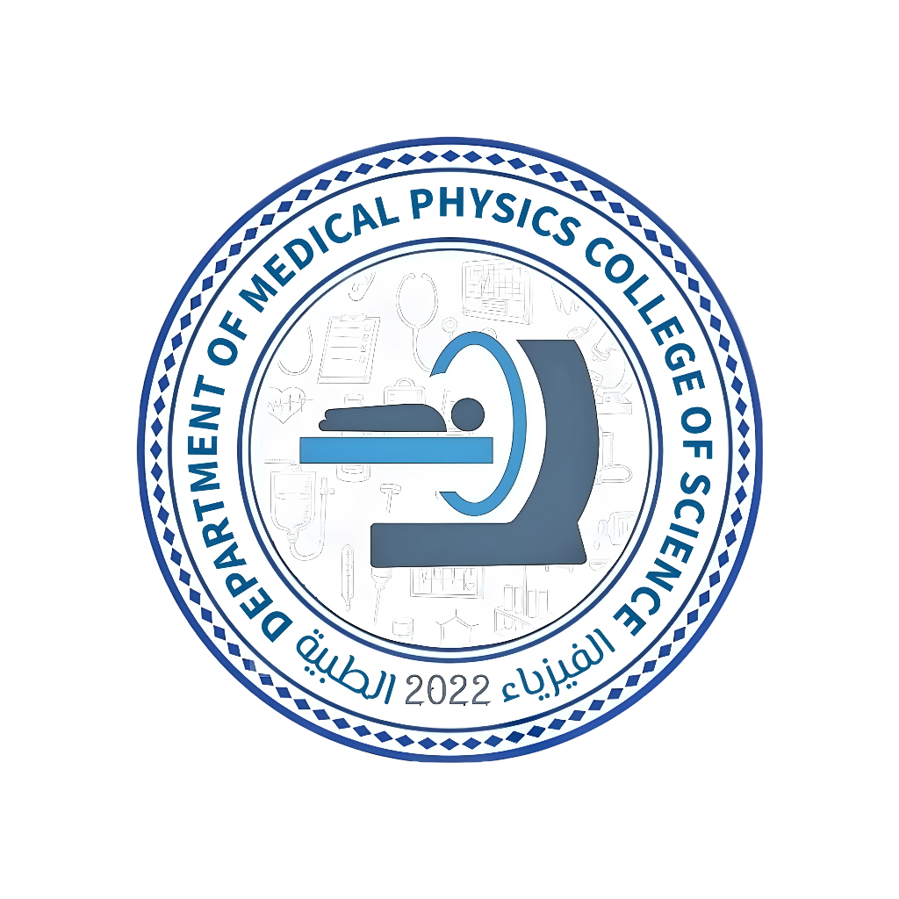
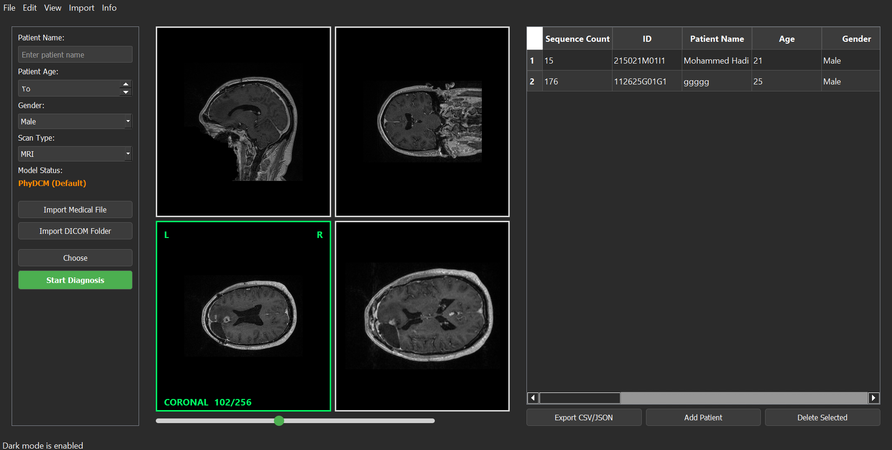
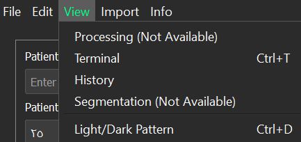
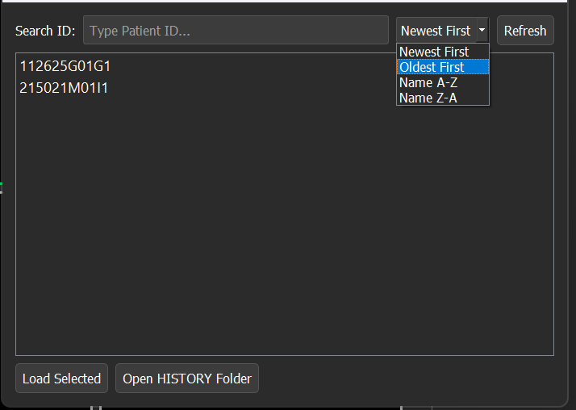

# 🧠 PhyDCM – AI-Powered Medical Image Diagnosis & Prediction Platform

<p align="center">
  
</p>

<p align="center">
  <b>PhyDCM</b> is an open-source, research-oriented Windows desktop application for
  <b>medical image diagnosis and prediction</b> using Artificial Intelligence,
  built on top of the <b>PhyDCM</b> Python library and modern deep-learning models.
</p>

---

## 🖥️ Application Highlights

<p align="center">
  
</p>

<p align="center">
  
</p>

<p align="center">
  
</p>

---

## 👨‍🔬 Research & Development Team

<table align="center">
  <tr>
    <td align="center">
      <br/>
      <b>Prof. Dr. Haider Saad Abdulbaqi</b><br/>
      <sub>Research Supervisor</sub>
    </td>
    <td align="center">
      <br/>
      <b>Mohammed Hadi Rahim</b><br/>
      <sub>Lead Developer & First Assistant</sub>
    </td>
    <td align="center">
      <br/>
      <b>Mohammed Hassan Hadi</b><br/>
      <sub>Student Researcher</sub>
    </td>
  </tr>
  <tr>
    <td align="center">
      <br/>
      <b>Haider Ali Aboud</b><br/>
      <sub>Student Researcher</sub>
    </td>
    <td align="center">
      <br/>
      <b>Ali Hussein Allawi</b><br/>
      <sub>Student Researcher</sub>
    </td>
    <td></td>
  </tr>
</table>


### 👨‍💻 Student Researchers
- **Mohammed Hadi Rahim** – Lead Developer & First Assistant  
- Mohammed Hassan Hadi  
- Haider Ali Aboud  
- Ali Hussein Alawi  

### 🎓 Academic Supervision

- **Prof. Dr. Haider Saad Abdulbaqi**  
  *Research Supervisor*

---

## 📌 Project Overview

**PhyDCM** is a PyQt5-based medical imaging application designed to assist researchers
and students in analyzing and predicting diagnostic outcomes from medical images.

The application currently supports:
- 🧠 **MRI**
- 🫁 **CT**
- ⚛️ **PET**

and is architected to support additional modalities and models in future releases.

This project was developed as a **graduation research project** and is intended
primarily for **academic and research purposes**.

---

## 🎯 Key Objectives

- Provide a **research-grade AI medical imaging platform**
- Support **optional AI inference** using TensorFlow/Keras
- Maintain **full usability even without AI dependencies**
- Promote **open-source research, transparency, and reproducibility**
- Offer a **professional Windows desktop experience**

---

## ✨ Features

| Category | Description |
|-------|------------|
| 🖼️ Medical Imaging | Load and visualize medical images (MRI / CT / PET) |
| 🤖 AI Diagnosis | AI-based prediction and diagnosis via PhyDCM |
| 🧠 Multi-Model Support | Separate trained models per modality |
| ⚙️ Optional TensorFlow | Application runs with or without TensorFlow |
| 🪟 Desktop UI | Modern PyQt5 interface |
| 📊 Research-Ready | Designed for academic experimentation |
| 🔓 Open Source | Fully transparent and extensible |

---

## 🧩 AI Models

PhyDCM currently integrates **three trained AI models**:

| Modality | Model Status |
|--------|-------------|
| MRI | ✅ Available |
| CT | ✅ Available |
| PET | ✅ Available |

> ⚠️ Additional models and modalities may be added in future versions as part of ongoing research.

---

## 🖥️ System Requirements

| Component | Requirement |
|---------|-------------|
| OS | Windows 10 / 11 (64-bit) |
| Python | **Python 3.12** |
| GUI | PyQt5 |
| AI (Optional) | TensorFlow / Keras |
| Hardware | CPU (GPU optional) |

---

## 🚀 Installation

### 🔹 Option 1: Windows Executable (Recommended)
1. Go to **GitHub Releases**
2. Download the latest `PhyDCM.exe`
3. Run the application directly (no Python required)

> The application works **with or without TensorFlow**.  
> AI features are automatically enabled when TensorFlow is available.

---

### 🔹 Option 2: Run from Source (Developers / Researchers)

```bash
git clone https://github.com/your-username/PhyDCM-App.git
cd PhyDCM-App
python -m venv .venv
.venv\Scripts\activate
pip install -r requirements.txt
python -m phydcm_app
